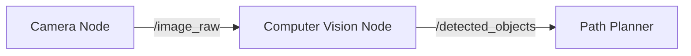

# Week 2: ROS 2 Communication

## 🎯 Learning Objectives

<LearningObjective objectives={[
  "Master Pub/Sub messaging with Topics",
  "Implement Request/Reply with Services",
  "Debug utilizing RQt Graph"
]} />

## 1. The Flow of Data (Topics)

**Topics** are the primary way data moves in ROS 2. It follows a **Publisher/Subscriber** model.
- **Asynchronous**: Publishers don't know who is listening.
- **Many-to-Many**: One topic can have multiple publishers and subscribers.

### Conceptual Diagram



## 2. Hands-On: Pub/Sub implementation

Creating a publisher that counts up.

```python
self.publisher_ = self.create_publisher(String, 'topic', 10)
timer_period = 0.5  # seconds
self.timer = self.create_timer(timer_period, self.timer_callback)
```

## 3. Services (Synchronous)

Sometimes you need an answer *now*.
- **Client**: Sends a request (e.g., "Reset Simulation").
- **Server**: Processes and sends a response.

### Lab Task
Use `ros2 service call` to reset the Turtlesim background color.